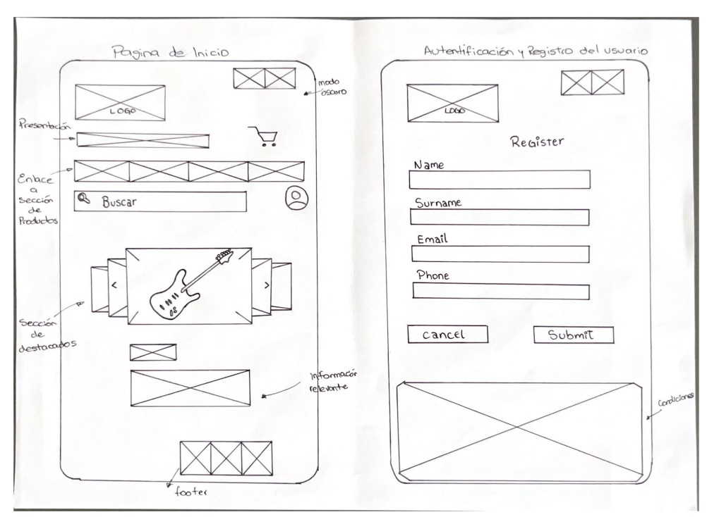

# P0_wireframe

# Tienda de guitarras deluxe

Diseño del wireframe de baja fidelidad (BF) de un E-commerce para vender guitarras deluxe. 

Necesidades Básicas del cliente:

1. Página de inicio:
````
    a) Presentación de la tienda y las guitarras deluxe.
    b) Sección de destacados con imagenes y descripciones breves.
    c) Enllace a la sección de productos.
````
2. Catálogo de los productos:
````
    a) Lista de guitarras con imagenes, descripciones, precios y opciones extras de producto.
    b) Filtro por marca, precio y tipos de guitarra.
````
3. Detalles del producto:
````
    a) Página detallada de cada guitarra con imagenes, especificaciones técnicas y reseñas de clientes.
    b) Formulario inserción de nuevos productos.
````
4. Cesta de Compra y Checkout:
````
    a) Funcionalidad para agregar y eliminar productos de la Cesta.
    b) Proceso de checkout seguro con opciones de pago variados.
````
5. Autenticación y Registro de Usuarios:
````
    a) Formularios para registrase y login de usuarios.
    b)Opción de recuperación de contraseña.
````
6. Blog y Noticias:
````
    a) Sección para publicar articulos sobre guitarras, mantenimento y noticias del sector.
````




